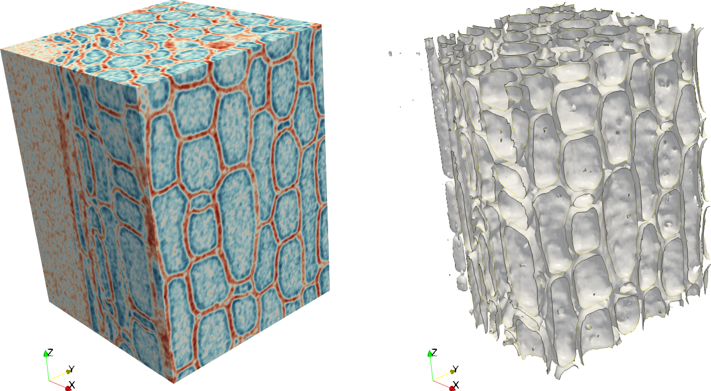

# From TIFF to 3D mesh with VTK

* Use [vtkFlyingEdges3D](https://vtk.org/doc/nightly/html/classvtkFlyingEdges3D.html), [vtkTIFFReader](https://vtk.org/doc/nightly/html/classvtkTIFFReader.html) to create a `vtkPolyData` from a set of TIFF files.
* Data are from [Spatially-localized X-ray scattering and X-ray microtomography measurements on Moso bamboo, Ahvenainen, Patrik; Dixon, Patrick G.; Kallonen, Aki; Suhonen, Heikki; Gibson, Lorna J.; Svedström, Kirsi](https://zenodo.org/record/60046/)

